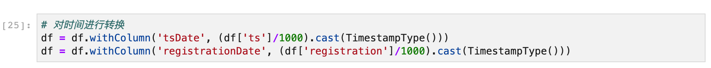

# 定义
## 绪论
Sparkify是一个虚拟的数据集。他包含了用户对于一个音乐网站的访问情况的数据。对于一个网站的运营者来说，他们很关心的一个问题是用户流失的问题。知道什么样的用户可能会成为流失用户，提前采取措施来防止他们的流失。
在这个项目中，我们通过对于用户数据的分析，使用机器学习的方法建立模型来预测哪些用户可能会成为流失的用户。
## 问题阐述
这个项目的目的是建立一个机器学习的模型，来预测用户会流失或者不会流失。因此这个模型应该是一个二分类的模型。目前有很多针对二分类问题的模型，如果能够合理的对数据进行预处理，那么一定能够训练出比较好的模型。建立模型的步骤如下：
1. 对于数据进行简单的浏览，了解各个特征的特点
2. 进行简单的数据可视化，查看数据的特点
3. 进行特征工程，提取我们需要的特征
4. 再一次进行可视化，重点查看特征工程后各个特征之间的相关性，已确定是否可以开始建模，还是需要继续执行特征工程。
5. 建立模型
6. 对于模型进行验证
---- 
## 衡量标准
对于一个二分类问题的衡量标准有很多。比较常用的有准确率，精度，召回率，F1 score, AUC等等。针对不同的问题采用不同的衡量标准。比如说，对于信用卡欺骗的事件，因为信用卡用户中具有欺骗性为的用户远远少于正常用户，因此我们的数据集中的label分布严重的不均匀。这样的模型的训练结果可能是模型的输出大多数是非欺骗用户。如果我们使用accuracy作为指标，那么可能accuracy是非常高的。因此这个时候使用accuracy做为指标是不太合适的。而是用召回率作为指标更加的合适。
在这个项目中，在选用指标时，我们也需要确定流失用户和非流失用户之间的分布。

# 分析
## 数据分析
Sparkify数据集中包含了286500行数据，每行数据包含18列。每行包含的数据如下：
* artist (string): 歌曲的艺术家
* auth (string):  用户的验证级别
* firstName (string): 用户的名
* gender (string): 用户的性别
* itemInSession (bigint): 在一个session中登陆的次数
* lastName (string): 用户的姓
* length (double): 歌曲的长度是多少秒
* level (string)：用户的订阅级别
* location (string)：用户的地理位置
* method (string)：http方法
* page (string)：用户所在的页面
* registration (bigint)：用户注册的时间戳
* sessionId (bigint)：session id
* song (string)：歌曲的名称
* status (bigint)：http返回的状态
* ts (bigint)：这条记录的时间戳
* userAgen (string)：用户所使用的客户端
* userId (string)：用户的id
根据这些数据，我们可以将数据分为三个种类，一个是用户级别的数据，一个网络级别的数据，一个是音乐级别的数据。
用户级别的数据包括：userId, first name, lastName, gender, location, userAgent, registration, level。其中level数据与其他的数据不同，它是会变化的，反映了用户的订阅状态。

 
## 可视化探索
目前的数据很难进行可视化的探索，只能进行一些简单的可视化。最简单地，我们可以先看一下用户的性别分布。下图为用户的性别分布，可以看出男性的用户更加地多。

 

## 算法

在这个项目中，需要构建的是一个二元的分类器。所以，可以选择的有很多。最简单的Logistic回归，朴素贝叶斯，SVM等等。使用不同的算法，又有不同的参数需要调整。这将会在后面介绍。
 
## Benchmark 
对于Benchmark来说，我们可以选用最简单的Logistic回归训练出来的结果作为Benchmark。因为Logistic是最简单的方法。

# 方法
 
 
## 数据预处理
数据的预处理是很重要的一步。它的主要作用是从数据中提出或者加工我们需要的特征。有了这些特征，在训练模型的时候才有材料。
在之前我们提到，这里的数据有三个级别的数据：用户级别的数据，与音乐有关的信息，与网站访问有关的信息。因为这个项目是针对用户的流失的，因此在模型中需要输入的是用户的信息。所以我们需要将这些特征都表示成用户级别的特征。
### 确定观测时间
想要将数据转换成用户级别的数据，我们需要把每个用户对应的每条数据进行融合。这些用户数据中有时间特征，包括ts(本条数据的时间戳)和registration（用户的注册时间）。首先我们将他们转换成年月日时分秒的时间格式，让时间看起来更加的直观，然后从中确定出时间的观测时间。

接着，我们可以查看ts的最大值和最小值。

从上面可以看出，观测时间可以选为2018-10-01 08:00:00到2018-12-01 08:00:00，需要注意的是以上两个时间都是以北京时间计算的。
### 用户真实的注册时间
确定了注册时间以后，我们可以开始对这段时间的数据，以不同用户作为基准进行合并了。这里还有一个问题，那就是有些用户的注册时间在观测开始时间之后。但这些用户在这个注册开始之前就有活动了，因此我们需要找出这些用户真正开始使用的时间来代替注册时间。可以通过`sessionId`来进行判断。因为用户在一段时间内的`sessionId`都是一样的。因此，如果某一条数据的`page`是’Submit Registration’的，那么于这条数据的`sessionId`是一样的数据，就是同一个用户的操作。
### 将数据转换成用户级别的数据
接下来需要将数据转化成用户级别的数据。也就是说，数据每一行代表的是一个用户。这个数据集中包含一下的列：
* userId
* lastLevel：用户最后的订阅级别，用0和1表示(0表示免费用户，1表示付费用户)
* gender：性别，以0和1来表示。（0表示女，1表示男）
* obsstart, obsend：观测开始的时间和结束的时间
 * endstate：用户在观测时间内的最后一次操作。

### 引入更多的特征
上面的特征显然是不够的，我们可以根据用户的操作引入更多的特征：
数值统计方面的特征
* nact：用户在观测时间内的总的操作数量
* nsongs, ntbup, ntbdown, nfriend, nplaylist, ndgrade, nupgrade, nhome, nadvert, nhelp, nsettings, nerror: 用户的各种操作分别进行统计
* recent，nact\_oldest：用户在最后的k天和最初的k天的活动，recent是最后的几天，oldest是最初的几天
* nsongs\_recent, nsongs\_oldest: 用户在最后的k天和最初的k天听的歌的数量，recent和oldest的含义与上面相同
* nact\_perh：用户在每个小时中的交互次数
$$nact\_perh=\frac{nact}{obshous}$$
* nsongs\_perh, ntbup\_perh, ntbdown\_perh, nfriend\_perh, nplaylist\_perh, nhome\_perh, nadvert\_perh, nerror\_perh都和上面的nact\_perh类似的计算
* songratio: 听歌在用户所做的交互中所占的比例
$$songratio = \frac{nsongs}{ncat}$$
* positiveratio: 正面的交互在用户的所有交互中所占的比例
$$positiveratio = \frac{ntbup+nfriend+nplaylist}{nact}$$
* negtiveratio：负面的交互在用户的所有交互中所占的比例
 $$negtiveratio = \frac{ntbdown+nhelp+nerror+nsettings}{nact}$$
* updownratio: thumbs up和thumbs down的比例，为了防止分母为0的情况，在分母加上0.1
$$updownratio = \frac{ntbup}{ntbdown+0.1}$$
* upgradedowngrade: 订阅登记改变的次数
$$upgradedowngrade = upgrade + downgrade$$
趋势特征：
* trend\_act: 用户的活动趋势
$$trend\_act=\frac{nact_recent(k)-nact_oldest(k)}{k\times obshours}$$
* trend\_songs: 用户的歌曲播放量的趋势
$$trend\_nsongs=\frac{nsongs_recent(k)-nsongs_oldest(k)}{k\times obshours}$$
交互方面：
* avgsessionitems: 用户在一个session中平均的交互次数
* avgsessiontime: 用户的session的平均长度
* avgsongs: 用户在两个连续的home页访问之间的平均歌曲播放数量
### 定义流失的用户
这个项目的目标是为了预测哪些用户是潜在的流失用户，因此这个数据集的label很明显就是用户是否流失。这里我们创建一个变量label。在前面** 将数据转换成用户级别的数据**这个部分，创建了一个变量`endstate`，其反应了用户最后查看的页面。可以从这个变量看出用户最后是否流失了。如果用户最后的页面是`Cancellation Confirmation`那么用户就流失了。
我们创建了一个二元的变量`label`，用0表示没有流失，1表示流失了。
### 探索性数据分析
经过对数据集进行了一番特征工程已够，可以重新进行探索性数据分析来看看现在数据的状况。
#### `label`的分布
一下是变量`label`的分布情况的直方图。从直方图可以看出，这个`label`的分布不是均衡的。流失的用户相比于未流失的用户少非常多。

#### 数据的相关性热力图
以下是各个特征之间的相关性的热力图。

#### 各个变量与label的相关性
以下表示的是各个变量与label之间的相关关系。

## 创建模型Pipeline
这里我们创建了三个模型，Logistic回归作为Benchmark，另外两个模型为Random Forests和Gradient-boosted decision tree。
选用的特征列有13个：`nsongs_perh`，`ntbup_perh`，`ntbdown_perh`，`nfriend_perh`，`nadvert_perh`，`upgradedowngrade`，`songratio`，`positiveratio`，`negativeratio`，`updownratio`，`trend_songs`，`avgsessionitems`，`avgsongs`。
其中Logistic回归是最简单的模型。
Random Forest的一个优点是能够处理很高纬度的数据。同时，在创建Random Forest的时候，对generalization error使用的是无偏估计，因此模型对泛化能力比较强。它的缺点是，在某些噪声较大的回归或者分类问题上会产生过拟合。
Gradient-boosted decision tree的优点是预测的精度高，可以灵活的处理各种类型的数据，包括连续值和离散值。很适合与我们选用的特征，其中既有连续值也有离散值。但是Gradient-boosted decision tree也有缺点。由于其中的弱学习其之间存在依赖关系，难以实现并行训练数据。因此，训练所需要的时间可能比较长。
整个Pipeline包含四个模块：第一个VectorAssembler将数值特征放到同一个Vector里面， 一个StandardScaler将上一个模块中的数值特征进行归一化，第二个VectorAssembler将数值为二元的变量和上面处理后的数值特征合并到一个Vector中，最后一个是上面的三个模型中的其中一个，用来做预测。
上面的三个模型都是用`ParamGridBuilder()`来构建自己的训练参数，来优化模型。
Logistic回归的模型参数：
* maxIter: 10, 30
	* regParam: 0.0, 0.1
	* elasticNetParam: 0.0, 0.5
	Random Forest的参数：
	* maxDepth: 4,5,6,7
	* numTrees: 20,40
	Gradient-boosted Tree参数：
	* maxDepth: 4,5
	* maxIter: 20,100
接下来将数据集分割成训练集和验证集，它们的比例是8:2。

# 结果
## 模型评估
使用上述参数进行训练以后，将验证集中结果最好的参数用在测试集中，查看在测试集中的表现。
Logistic回归在测试集中的表现如下：

其中表现最好的参数是maxIter为10，elesticNetParam为0.0，regParam为0.0。测试得到的AUC为0.832，F1为0.667
Random Forest的训练结果如下：

可以看出最好的结果对应的训练参数是maxDepth=4，numTrees=40的时候。用这个参数来训练得到AUC为0.914，F1为0.667。

Gradient-boosted tree的训练结果如下：

可以看出最好的结果对应的训练参数是maxDepth=4, maxIter=100。使用这个参数训练得到的AUC位0.846，F1为0.727。

将上面的结果汇总在一起

从上面的结果可以看出，Random Forest具有最高的AUC得分，Gradient-boosted tree具有最高的F1 score。

# 结论
从结果中可以看出，使用Random Forest可以得到不错的AUC和F1 score。尤其是AUC可以达到90%以上。
## 反思和改进
在这个项目中的特征工程这个部分还有可以改进的地方。在选择模型中需要的特征的时候，直接选择了后面合成的那些特征，但是那些特征的筛选工作不够细致。后期改进的时候可以更加详细地分析这些特征和label的相关性。然后选完了特征得出验证集的结果以后，继续改用其他的可能特征组合进行训练，对比训练结果。
在模型的训练过程中也可以尝试更多的参数，比如说学习率。
